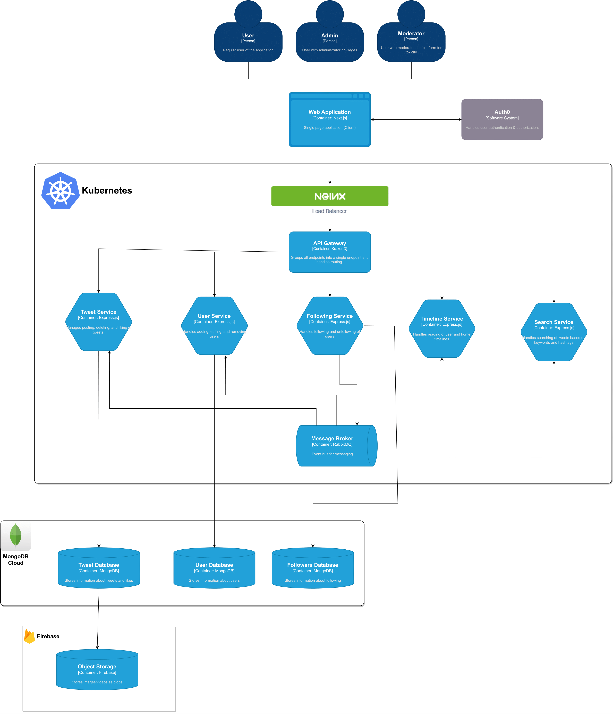

# Kwetter

Welcome to Kwetter, a scalable Twitter-clone application housed in a Turbo monorepo. The platform allows users to post tweets containing text and links, engage with posts by liking them, and follow other users to stay up-to-date with their tweets. All these features are accessible to everyone on Kwetter.




## Tech Stack

- Backend Microservices: Express.js
- Frontend: Next.js
- Databases: MongoDB
- Message Broker: RabbitMQ
- API Gateway: KrakenD
- Authentication/Authorization: Auth0
- Deployment: Kubernetes Cluster on Azure
- Container Registry: Azure Container Registry (ACR)
- End-to-End Testing: Playwright
- Availability Monitoring: Uptime-Kuma

This application also features monitoring, logging, and alerting systems using the Grafana, Prometheus, and Loki stack. It is stress-tested using K6 to ensure smooth scalability.

## Features

- Post tweets: Users can share their thoughts, including text and links.
- Like tweets: Users can like the tweets they find interesting.
- Follow other users: Users can stay up-to-date with their favorite accounts by following them.
- Scalability: The application, designed with a multi-microservice architecture, offers robust scalability.

## Demo

A demo of the application can be found at the following link: 

[Link to the demo video on Google Drive](https://drive.google.com/file/d/13oyOHfVDi_CC_UYl4tFuhxe3i01Oj9un/view?usp=sharing)

## Setup and Installation

Follow these steps to get Kwetter up and running on your local machine for development and testing purposes.

### Prerequisites

- Node.js
- MongoDB
- RabbitMQ
- Docker
- Kubernetes

### Instructions

1. Clone the repository:

```bash
git clone https://github.com/stassig/IndividualProject.git
```

2. Install the dependencies:

```bash
yarn install
```

3. Set up your environment variables in a `.env` file:

```env
# App URLs
NEXT_PUBLIC_URL=XXXXX
NEXT_PUBLIC_GATEWAY_URL=XXXXX

# DB URLs
DB_URL_TWEET=XXXXX
DB_URL_USER=XXXXX
DB_URL_TIMELINE=XXXXX

# Auth0
AUTH0_SECRET=XXXXX
AUTH0_BASE_URL=XXXXX
AUTH0_ISSUER_BASE_URL=XXXXX
AUTH0_CLIENT_ID=XXXXX
AUTH0_CLIENT_SECRET=XXXXX

# RabbitMQ
RABBITMQ_URL=XXXXX
```

4. Start the application:

```bash
yarn dev
```

To run the API gateway:

```bash
yarn proxy
```

To run the message broker:

```bash
yarn rabbitmq
```

Now you should be able to see the app running at `localhost:3000`.

## Deployment

This application is deployed in a Kubernetes cluster on Azure, with Azure Container Registry (ACR) as the container registry. Please refer to the [Kubernetes documentation](https://kubernetes.io/docs/home/) and [Azure's Kubernetes Service documentation](https://docs.microsoft.com/en-us/azure/aks/) for deployment instructions.

## Testing

K6 is used for load testing and Playwright for end-to-end testing. To run the load tests:

```bash
k6 run loadtest.js
```

To run the end-to-end tests:

```bash
npx playwright test
```

You can also run tests using:

```bash
yarn test
```

## Monitoring, Logging, Alerting, and Availability

Monitoring, logging, and alerting are done using a Grafana, Prometheus, and Loki stack. The application's availability is monitored using the self-hosted Uptime-Kuma service. Please refer to each tool's respective documentation for configuration and usage details.

---
